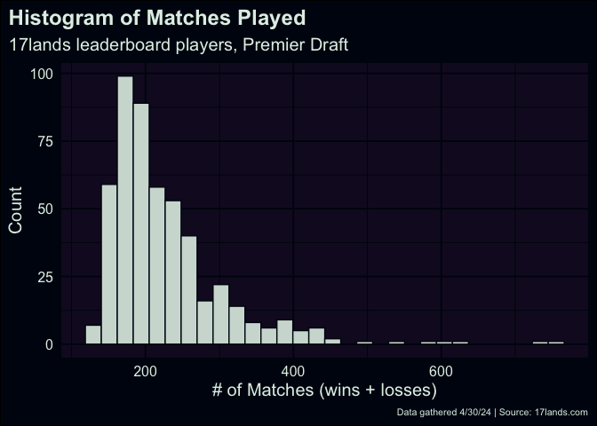

The [17lands leaderboard](https://www.17lands.com/leaderboard) is great,
but leaves a little to be desired with one of its metrics. When glancing
at the table of players, I’m drawn to the listed win rates, but usually
find myself distracted by the accompanying count of match wins. Players
listed on the leaderboard vary a lot on the number of matches they have
recorded. For example, for players on the premier draft leaderboard, the
average number of matches is 227.2, with a standard deviation of 80.9.

When evaluating a player’s win rate, a larger number of matches recorded
is more informative of their performance. For those with a smaller
number of matches recorded, we should be less confident in their
presented rate. This problem is perfect for an application of Bayesian
inference.

# Ranking Algorithm

Currently, the 17lands leaderboard shows up to $N = 500$ players. We’ll
index the set of players with $i = 1, 2, \cdots, N$. Let
$\alpha_i,\beta_i \in \mathbb{Z^+}$ be an individual player’s respective
*match wins* and *losses* in a given limited format. We define
$\pi_i \sim Beta(\alpha_i, \beta_i)$ as a probability model for the
player’s *win rate.* Now, compute $\alpha'$ and $\beta'$ as:

$$
\begin{align*}
    \alpha' &= \lceil (0.004) \cdot \sum_{i = 1}^N \alpha_i \rceil \\
    \beta' &= \lceil (0.004) \cdot \sum_{i = 1}^N \beta_i \rceil.
\end{align*}
$$

These represent fractions of the total number of wins and losses
accumulated amongst players listed on the leaderboard. We will use the
model $\pi' \sim Beta(\alpha', \beta')$ as a *prior distribution* for
estimating each player’s win rate. Why are we using only a fraction of
the match wins/losses recorded in the leaderboard for our prior? For me,
this came down to two main reasons:

1.  First, our prior distribution should be an informed guess on what we
    think a player’s win rate might be. If a player doesn’t have many
    matches recorded, we’d want to lean on the prior distribution. In
    the dark, centering our prior on the leaderboard’s average should be
    fairly decent if we’re trying to guess an individual player’s win
    rate.

2.  At the same time, we don’t want to fully rule out an individual
    player’s capabilities. If we used *all* the data from the
    leaderboard, our prior will be concentrated too tightly around the
    leaderboard’s average win rate. Using a weaker (but still informed)
    prior lets the data coming from a player’s results have some weight.

Finally, our resulting *posterior distribution* is

$$
\pi'_i \sim Beta(\alpha_i + \alpha', \beta_i + \beta').
$$

From the resulting model, we can compute each player’s expected win rate
$E[\pi'_i]$, according to the formula for the beta distribution:

$$
E[\pi'_i] = \frac{\alpha_i + \alpha'}{\alpha_i + \alpha' + \beta_i + \beta'}.
$$

The collection of expected win rates
$(E[\pi'_1], E[\pi'_2], \cdots, E[\pi'_N])$ can then be sorted, with the
resulting position reflecting the rank of player $i$.
