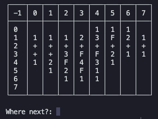

<svelte:head>
  <meta property="og:image" content="./sweeper.png" />
  <meta name="twitter:image" content="./sweeper.png" />
</svelte:head>

Most introductions to object-oriented programming (OOP) I've seen use a common example of an `Animal` class, which is then inherited by a `Dog` or `Cat` class to demonstrate basic attributes and methods. These are simple enough, especially if the reader is already familiar with OOP and the primary goal is understanding a language's syntax. However, for those new to programming or OOP as a paradigm, I think a better learning example might be found in the classic game of _Minesweeper._

This week I've been teaching myself a bit about terminal-based applications, and have been exploring concepts by implementing _Minesweeper_ in Python. It's possible _Minesweeper_ was the first computer game I ever played (probably on my grandparents' ancient PC on Windows 98). Despite being simple in concept and its mechanics, it's a fun little logic game. Like many classics, the rules can be described concisely:

- The game's **board** consists of N-many **squares**, arranged in a grid.
- A square can have up to 8 neighbors, and as few as 3 neighbors (if the square is in a corner).
- The edges of the board do not wrap around. For example, if there are N columns in the board, the square at location (0, 0) in the board is not neighbors with (0, N).
- Some number of squares hide a mine.
- At any point, the player can take 3 actions:
  - **Check a square.** If the square being checked contains a mine, the game is over. Otherwise, the square reveals the number of its neighbors hiding mines.
  - **Add (or remove) a flag.** If the player has marked all of the squares that hide mines (without incorrectly flagging an unmined square), the player wins.

This specification leads very naturally to an implementation of the game using object-oriented programming. To run the game, we essentially need to manage two species of objects: the squares in the board, and the board itself. The rest of the game's information and actions can be described as attributes of these objects, or methods defined on them. The board is responsible for storing the squares, and hosts methods used for interacting with them. The game itself is run in the body of a while-loop, accepting inputs from the player (representing their choices/actions), updating state based on the result of those inputs, and checking to see if a loss or victory has been achieved.

For example, we might declare a class for a `Square`, as follows:

```python
class Square:
    """A square on the board, located at (i, j) in the grid."""

    def __init__(self, i: int, j: int):
        self.i = i  # row of the square in the grid
        self.j = j  # column of the square in the grid
        self.point = (i, j)

        self.flag = False  # is there a flag on the square?
        self.is_open = False  # has the square been revealed?
        self.mine = False  # does the square contain a mine?
        self.n = -1  # updated when opened --> how many mines in the square's neighbors?

    def open(self) -> None:
        """Reveal the tile."""
        self.is_open = True
```

The `Board` class is more complicated, but its constructor (`__init__`) and its `.get()` method are key for everything else that the board needs to carry out.

```python
class Board:
    """The game's board, sized N x N. Each entry (i, j) is a Square."""

    def __init__(self, N: int, mines: int):
        self.playing = True
        self.turns = 0
        self.N = N
        self.M = mines
        self.squares = [Square(i=i, j=j) for i in range(N) for j in range(N)]
        self.display()

    def get(self, i: int, j: int) -> Square:
        """Get a square at location (i, j) in the board."""

        if i < 0 or i > self.N - 1:
            raise ValueError(f"i must be between 0 and {self.N - 1}.")

        if j < 0 or j > self.N - 1:
            raise ValueError(f"j must be between 0 and {self.N - 1}.")

        for square in self.squares:
            if square.point == (i, j):
                return square

    # ...
```

This lets us define another method, `.neighbors()`, which lets us extract a square's neighboring locations. Other methods handle the work of counting the number of mines, adding/removing flags, determining wins/losses, etc. I'm not sure if my code is as optimized as it could be (as far as searching the list for a matching tuple), but it's easy to understand and more than performant for what we're up to.

```python
class Board:
    """The game's board, sized N x N. Each entry (i, j) is a Square."""

    # ...
    # ...
    # ...

    def neighbors(self, i: int, j: int) -> list[Square]:
        """Return a list containing the (ith, jth) square's neighbors."""

        K = [max(0, i - 1), min(self.N - 1, i + 1)]
        L = [max(0, j - 1), min(self.N - 1, j + 1)]

        m = []
        for k in range(K[0], K[1] + 1):
            for l in range(L[0], L[1] + 1):
                if (k, l) != (i, j):
                    m.append(self.get(k, l))
        return m

    # ...
```

To complete the sketch, here's what the `main.py` program looks like. As written today, the program accepts keyboard responses from the user, and prints a simple table to reflect state (this is what `board.display()` is responsible for). The `.upkeep()` method determines when the program's loop should be exited.

```python
"""The game's entrypoint."""

from game import Board
from prompt import get_size, get_input

def main():
    """Main game loop."""

    n = get_size()
    board = Board(N=n, mines=10)

    while board.playing:
        flag, loc = get_input(board_size=board.N)

        if flag:
            if board.turns == 0:
                print("Pick a square first.")
                continue

            board.flag(*loc)
        else:
            board.check(*loc)

        board.upkeep()
        board.display()


if __name__ == "__main__":
    main()
```

Currently, my code is essentially a proof-of-concept, and only works for square grids. Additionally, the game won't behave correctly for grid sizes over 9x9. This is because my implementation relies on naive handling of the user's input. I'd like to polish it up with [Textual](https://textual.textualize.io/), and move from prompt-based commands to using input widgets provided by the framework. If you're curious, my code is available [here](https://github.com/ndrewwm/minesweeper) on GitHub.

<center>


</center>

Design considerations aside, I think I like this project as a toy example for building an OOP-based application. A similar approach I remember (either as a CodeAcademy or Exercism exercise, not sure) is to have the learner implement the game of "Battleship". However, I think _Minesweeper_ is a bit more satisfying, given that it's a single-player game. If I'm picking up a new OOP language in the future or trying to explain concepts to someone, I think I'll dig this back up.
