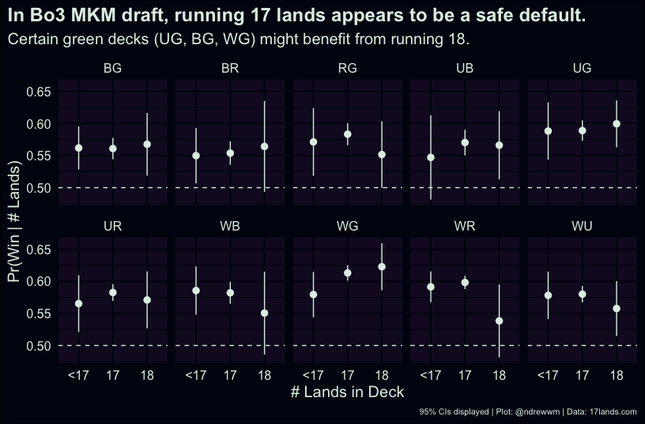

<BlogHead title={title} date={date} />

I’m playing in the MKM Arena Open tomorrow; the day 2 event is
best-of-three (Bo3) draft. A classic question for a given limited format
in Magic is how many lands a player should be running in their list.
This isn’t a simple question to answer, and depends on the kind of deck
that’s been drafted. However, I wanted to see if there were any patterns
that have emerged over the lifetime of the set since it was released
last month.

For this analysis, I’ve used game data from
[17lands.com](https://17lands.com/), and tallied the number of basic
lands and
[nonbasic](https://scryfall.com/search?q=set:mkm+type:land+-type:basic)
lands that a player has included in their list (by game). I’ve excluded
any games where a player submitted a deck with more than 18 lands; the
decision to run 19 is atypical for any limited format. This exclusion is
about 400 games in total.

First, we have the overall performance, without regard for other factors
(such as the colors in a player’s deck). While the differences between
our groups are pretty small, running a list with 17 lands has the
highest rate of success. This is also the most common choice by far
(approx. 79% of games are running a list with 17 lands).

| \# Lands     |         Losses |           Wins |
|:-------------|---------------:|---------------:|
| 16 (or less) |  6,485 (42.6%) |  8,752 (57.4%) |
| 17           | 41,708 (41.8%) | 58,057 (58.2%) |
| 18           |  4,909 (42.6%) |  6,625 (57.4%) |
| Overall      | 53,102 (42.0%) | 73,434 (58.0%) |

Breaking apart the decks by colorpair, we see some hints that green
decks might benefit from running 18. (Note, I’m excluding monocolor and
3+ color decks, but I’m not breaking out splashes.) Interestingly, it
looks like only WB benefits from running 16 lands. Every red deck in the
format is giving up a lot of consistency for playing fewer lands.

It seems notable that WR doesn’t seem to improve (on average) by cutting
lands. You might expect that it could afford to do so, given its access
to the best 1-drops in the format, such as *Novice Inspector*. However,
even a closer look at *Novice Inspector* suggests why this isn’t the
case. The benefit this card grants you for casting it (a clue token)
requires additional mana to leverage. Given the deck’s popularity, I
haven’t been able to draft it frequently, but the result we’re seeing
for WR makes sense. In modern limited formats, it’s difficult to
overstate the importance of impacting the board early. However, not
playing a land on turn 3 appears to be particularly punishing in MKM due
to the *disguise* mechanic. Even in aggressive decks, you have to keep
pace with your opponent along the mana curve. In terms of what’s
realistic for a given draft, there simply aren’t enough cards that cost
2 mana or less to form enough of a core for one’s deck.

For MKM, the choice of how many lands to play is complex, but running 17
remains a solid default. It seems that green decks with 18 lands might
outperform other builds in their colors, but you’ll need some good
intuition on whether your pool leans more towards the deck’s theoretical
ceiling to justify cutting an additional spell.
