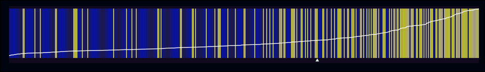
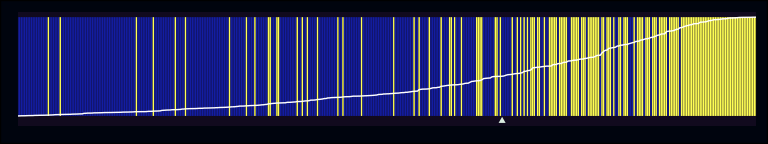
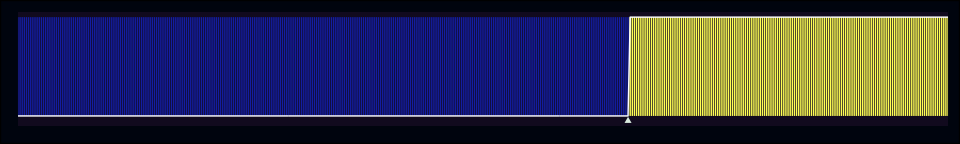

<script>
  import BlogHead from "$lib/components/BlogHead.svelte";
</script>

<BlogHead title={title} date={date} />

Ever since I first started learning about regression analysis, I found
myself wishing I could do something equivalent to inspecting residuals
for logistic regressions like you could with OLS. Earlier this week, I
was looking around for more ways to spot-check logistic regression
models, and I came across a plotting technique that’s described in <a
href="https://onlinelibrary.wiley.com/doi/full/10.1111/j.1540-5907.2011.00525.x#b11"
target="_blank">this paper</a> (Greenhill, Ward, & Sacks, 2011). They’re
called “separation plots”, and they’re used to help assess the fit
adequacy of a model that has a binary variable as its dependent
variable. (Edit: ugh, I was on university wifi when I was reading and
drafted out this post. I didn’t realize the paper was paywalled…now I
can’t even reread one of the sections I wanted to quote!)

The authors did create an R package with a `separationplot()` function,
but I found that it was handling R’s graphic devices a little strangely,
so I reimplemented a basic version with ***ggplot2***. Anyways, here’s
an example plot.

``` r
library(tidyverse)
library(scico)

fit1 <- glm(inmetro ~ percollege, data = midwest, family = binomial)

midwest$f1 <- predict(fit1, midwest, type = "response")

separation_plot(pred = midwest$f1, actual = midwest$inmetro)
```



Using the `midwest` dataset from ***ggplot2***, we’ve built an
underspecified model that’s meant to predict whether each county (from 5
midwestern states) is in a metropolitan area, based on the percentage of
adults that are college educated. So, what’s going on in this plot? Each
vertical line in the figure represents one of the 437 counties, with the
yellow lines reflecting *events* (i.e. instances where `inmetro == 1`).
Each vertical line in the figure is ranked in ascending order based on
the predicted probability output by the model. The further a vertical
line is to the left, the smaller its estimated probability.

A good model should be able to separate events from non-events, which
should translate into vertical lines of the same color clustering
together on their respective poles of the plot. For example, let’s look
at an improved version of the model we fit earlier.

``` r
fit2 <- glm(
  inmetro ~ percblack + percwhite + percollege + percpovertyknown + percbelowpoverty + percprof,
  data = midwest,
  family = binomial
)

midwest$f2 <- predict(fit2, midwest, type = "response")

separation_plot(midwest$f2, midwest$inmetro)
```



In comparison with the first plot, you can see that the non-events on
the left are still being broken up occasionally, but these patches are
less frequent and smaller. Conversely, on the right it seems like the
second model is assigning higher probabilities to counties that really
are in metropolitan areas. Let’s also talk about two other pieces of
information that are being included in these plots. First, there’s the
rising white line that runs the length of the figure. This simply
represents the predicted probability of each observation in the model
(with 0 at the bottom of the graph, and 1 at the top). As can be seen in
the second figure, the slope of the line begins to rise more quickly in
relation to the higher density of actual events. Second, there’s the
little white triangle just below the lower edge of the plot. This is
simply the sum of all the predicted probabilities, and I think is meant
to serve as an estimate of the total \# of expected events predicted by
the model.

In the case of a perfect model, the marker should be exactly at the
left-most edge of the events, like in the figure below.

``` r
# build a model that perfectly predicts each case
fit3 <- glm(inmetro ~ category, data = midwest, family = binomial)

midwest$f3 <- predict(fit3, midwest, type = "response")

separation_plot(midwest$f3, midwest$inmetro)
```



One of the things that feels appealing about this plotting approach is
that you can see all the data that’s being modeled. Similar to residual
plots, you’re able to get a sense of where fitted values are lying
relative to the observed result. It seems like these figures could be an
alternative or complement to ROC plots, and I’m curious if other folks
find them interesting or useful.

Lastly, here’s the function if you wanted to roll your own ggplot.

``` r
separation_plot <- function(pred, actual, show_legend = FALSE, predline = TRUE, show_expected = TRUE) {
  dat <- tibble(pred = pred, actual = actual) %>%
    arrange(pred) %>%
    mutate(position = 1:n())
  
  p <- dat %>%
    ggplot(aes(x = position, xend = position, y = 0, yend = 1, color = factor(actual))) +
    geom_segment() +
    scale_color_scico_d(palette = "imola") +
    scale_x_continuous(expand = c(0, 0)) +
    theme(
      axis.text = element_blank(),
      axis.title = element_blank(),
      panel.grid = element_blank(),
    )
  
  if (!show_legend) {
    p <- p + theme(legend.position = "none")
  }
  
  if (predline) {
    p <- p + geom_line(aes(x = position, y = pred))
  }
  
  if (show_expected) {
    p <- p +
      annotate(geom = "point", x = max(dat$position) - sum(dat$pred), y = -0.05, shape = 17)
  }
  
  p
}
```
