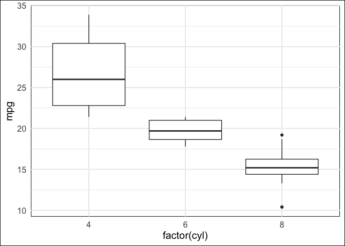

This is where the title would go, if that’s important.
================
Andrew
7/3/23

Hello.

What have I figured out about using Quarto/Mdsvex?:

1.  `fig.path` needs to be set to \`“./+page_files/”

    - you can then use the relativeImages npm package to properly link
      to output files

2.  If you add **both** `fig.cap` and `fig.alt`, plot outputs will be
    wrapped with a `<figure>` tag. This could be helpful? Maybe the
    stuff can be styled now…

3.  Adding `class-output` and `class-message` to `opts_chunk` wraps R
    code chunk output/messages with “\`\`\` qmdoutput”. Not sure how
    this is then parsed by Mdsvex, but it’s something?

4.  Layouts ensure you only have to load CSS once?

## Todo

- [x] plot output (relative image paths)
- [ ] how to do math
- [x] code highlighting
  - gonna say this is done, 90% of what I’ve been looking for
- [ ] footnotes?
- [ ] citations?

## Styles?

Can we add styles?

Hell yes we can.

## Testing output/rendering

Here is a quote:

> The asphault city is my home. Furnished
>
> From the outset with every sacramental prerequisite:
>
> With newspapers. And tobacco. And brandy.
>
> Distrustful and idle and contented to the end.

Here is some math.[^1]

$$
\int_0^1 x^3 + \theta x^2 dx
$$

Math can also be inline, like this:
$y = \beta_0 + \beta_1 x_1 + \epsilon$.

``` r
library(tidyverse)
```

``` qmdmessage
── Attaching core tidyverse packages ──────────────────────── tidyverse 2.0.0 ──
✔ dplyr     1.1.2     ✔ readr     2.1.4
✔ forcats   1.0.0     ✔ stringr   1.5.0
✔ ggplot2   3.4.2     ✔ tibble    3.2.1
✔ lubridate 1.9.2     ✔ tidyr     1.3.0
✔ purrr     1.0.1     
── Conflicts ────────────────────────────────────────── tidyverse_conflicts() ──
✖ dplyr::filter() masks stats::filter()
✖ dplyr::lag()    masks stats::lag()
ℹ Use the conflicted package (<http://conflicted.r-lib.org/>) to force all conflicts to become errors
```

``` r
theme_set(
  theme_minimal(base_size = 15) +
    theme(
      panel.background = element_rect(fill = "transparent"),
      plot.background = element_rect(fill = "transparent")
    )
)
```

``` r
summary(airquality)
```

``` qmdresults
     Ozone           Solar.R           Wind             Temp      
 Min.   :  1.00   Min.   :  7.0   Min.   : 1.700   Min.   :56.00  
 1st Qu.: 18.00   1st Qu.:115.8   1st Qu.: 7.400   1st Qu.:72.00  
 Median : 31.50   Median :205.0   Median : 9.700   Median :79.00  
 Mean   : 42.13   Mean   :185.9   Mean   : 9.958   Mean   :77.88  
 3rd Qu.: 63.25   3rd Qu.:258.8   3rd Qu.:11.500   3rd Qu.:85.00  
 Max.   :168.00   Max.   :334.0   Max.   :20.700   Max.   :97.00  
 NA's   :37       NA's   :7                                       
     Month            Day      
 Min.   :5.000   Min.   : 1.0  
 1st Qu.:6.000   1st Qu.: 8.0  
 Median :7.000   Median :16.0  
 Mean   :6.993   Mean   :15.8  
 3rd Qu.:8.000   3rd Qu.:23.0  
 Max.   :9.000   Max.   :31.0  
                               
```

Some more output.[^2]

``` r
lm(mpg ~ wt + cyl, data = mtcars) |> summary()
```

``` qmdresults

Call:
lm(formula = mpg ~ wt + cyl, data = mtcars)

Residuals:
    Min      1Q  Median      3Q     Max 
-4.2893 -1.5512 -0.4684  1.5743  6.1004 

Coefficients:
            Estimate Std. Error t value Pr(>|t|)    
(Intercept)  39.6863     1.7150  23.141  < 2e-16 ***
wt           -3.1910     0.7569  -4.216 0.000222 ***
cyl          -1.5078     0.4147  -3.636 0.001064 ** 
---
Signif. codes:  0 '***' 0.001 '**' 0.01 '*' 0.05 '.' 0.1 ' ' 1

Residual standard error: 2.568 on 29 degrees of freedom
Multiple R-squared:  0.8302,    Adjusted R-squared:  0.8185 
F-statistic: 70.91 on 2 and 29 DF,  p-value: 6.809e-12
```

``` r
mtcars |>
  group_by(vs) |>
  summarize(m = mean(mpg), s = sd(mpg)) |>
  knitr::kable(digits = 2)
```

|  vs |     m |    s |
|----:|------:|-----:|
|   0 | 16.62 | 3.86 |
|   1 | 24.56 | 5.38 |

Plots are messy though.[^3]

``` r
ggplot(mtcars, aes(x = factor(cyl), y = mpg)) + geom_boxplot()
```

<figure>

<figcaption aria-hidden="true">This is the caption.</figcaption>
</figure>

Sick, this is working now.[^4]

[^1]: There might be footnotes.

[^2]: Pay this no mind.

[^3]: Hey, you can also create in-line footnotes. They seem super
    convenient.

[^4]: You could consider writing something that’s incredibly long as a
    footnote.

    These long footnotes could even span multiple paragraphs. However,
    note that new paragraphs need to be indented.
