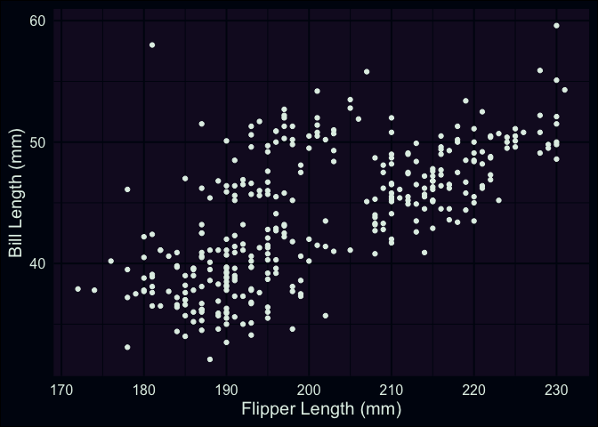
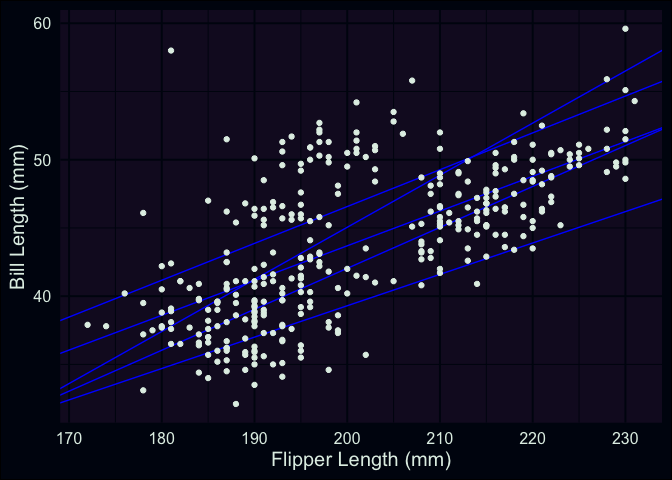
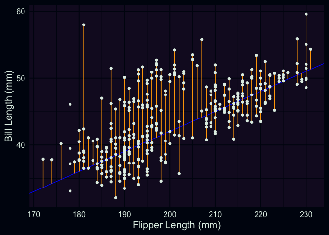

<script>
  import Banner from "$lib/home/Banner.svelte";
  import Head from "$lib/components/Head.svelte";
</script>
<style>
  img {
    object-fit: scale-down;
    max-width: 100%;
  }
</style>
<Head title="A primer for Linear Regression (part 1)" />

<Banner sub="A primer for Linear Regression" link="/projects/linear-regression-primer" />

{date}

# Part 1

This year, my partner has been working to complete her Masters in
Natural Resources/Land Management, and several of her assignments have
required some data analysis. One topic area we covered together was
linear regression/multiple linear regression. As techniques, simple
linear regression and multiple linear regression are well-known as
workhorses for answering statistical questions across many scientific
fields. Given their ubiquity, having the requisite working knowledge
needed to interpret and evaluate a regression analysis is highly
valuable in virtually any professional field that involves the use or
consumption of data. This post is the first in a series, and I have a
few objectives I hope to have met when they’re completed:

1.  Summarize the basic overview of linear regression I covered with my
    partner this year
    - I’d like to have my notes in one place, and maybe placing them
      where others can find them would be useful
2.  Explain the minimal code needed to fit a regression model in R
3.  Introduce a few commonly-used R packages that can make interpreting
    and evaluating a regression model easier

For this series, I’m assuming you have a bit of exposure to the R
language, ideally know how to make a plot with the `{ggplot2}` package,
and can do some basic algebra. The focus of this post will be a
big-picture overview of the mathematical problem that linear regression
is attempting to solve, but one of the best resources I’ve encountered
on the mechanics of regression is a
<a href="http://chrishenson.net/website/regression.html"
target="_blank">blog post</a> written by Chris Henson. Henson’s post is
detailed (& a bit lengthy), but if you’re curious about the mathematical
underpinnings of a regression analysis beyond what I discuss here, it
might be of interest to you. Additionally, I don’t know if I’ll dedicate
posts to this subject myself, but I’ve greatly appreciated Jonas K.
Lindelov’s initial
<a href="https://twitter.com/jonaslindeloev/status/1110907133833502721"
target="_blank">twitter thread</a> and
<a href="https://lindeloev.github.io/tests-as-linear/"
target="_blank">website</a> that illustrates how common statistical
techniques (such as t-tests, ANOVAs, correlations, etc.) are all linear
models, drawing on a shared statistical framework.

## motivation: outcomes & predictors

<!-- discussion of where name of analysis comes from? -->

Fundamentally, linear regression is used when an analyst is interested
in modeling the mean of a numeric & *continuous* outcome variable, based
on one or more inputs (called *predictor variables*, or
*predictors*)[^1]. In our case, we’re going to wear the hat of an
antarctic biologist, studying different characteristics of several
different species of Penguins in the south pole. You can follow along,
assuming you’ve installed the R language on your computer, and both the
[`{tidyverse}`](https://www.tidyverse.org/) and
[`{palmerpenguins}`](https://allisonhorst.github.io/palmerpenguins/)
packages.[^2]

Let’s assume that the outcome we’re interested in is the bill lengths of
the penguins we’re able to study in this region, such as the Gentoo (as
depicted by @[allison_horst](https://twitter.com/allison_horst/)).

<center>


</center>

For our research question, perhaps we’re interested in how well the
length of a penguin’s bill can be predicted by the length of its
flippers. We’ll start by visualizing this relationship as a scatterplot.

``` r
library(tidyverse)
library(palmerpenguins)

ggplot(data = penguins, aes(x = flipper_length_mm, y = bill_length_mm)) +
  geom_point() +
  labs(x = "Flipper Length (mm)", y = "Bill Length (mm)")
```



Right away, we can see a positive assocation; penguins with longer
flippers tend to have longer bills. This is a good start, but if we
wanted to summarize this association (or predict the bill lengths of
penguins not in our data), we could try using a statistical model to do
so. One of the simplest models we could use is a line, with the slope
summarizing how bill length changes per 1-mm increase in flipper length.
Fair enough, but how do we choose or specify which line to summarize the
pattern in our data? Here’s our scatterplot again, but with a handful of
candidate lines that we could draw through the points.

``` r
ggplot(penguins, aes(x = flipper_length_mm, y = bill_length_mm)) +
  geom_abline(slope = c(0.2548, 0.27, 0.23, 0.3818, 0.3), intercept = c(-7.2649, -7.43, -6.7, -31.31, -17.96), color = "blue") +
  geom_point() +
  labs(x = "Flipper Length (mm)", y = "Bill Length (mm)")
```



I made up each of these lines, and some might be better or worse for
describing the association between the two variables. However, I could
keep going, plotting 10, 20, 1000 lines, etc. There’s an infinite number
that could be picked from! In practice, we need a method for choosing a
line that’s best for the data we have, based on some reasonable
criteria. This problem, *narrowing down an infinite number of
**possible** lines to **one,*** is the task that linear regression
attempts to solve.

## an approach for finding the best line (OLS)

I’m now going to reference some equations, but they’re really just to
clarify some commonly-used notation, and maybe jog your memory a little.
In algebra, we learn that a line can be defined using two points in a
plane (denoted $(x_1, y_1)$ and $(x_2, y_2)$), resulting in an equation
like this:

$$
y = b + mx
$$

where *m*, the *slope*, is defined as $m = \frac{(y_2-y_1)}{(x_2-x_1)}$
and *b*, the *intercept*, is $b = y_1 - m(x_1)$. In my last plot, all I
basically did was assemble and plot a bunch of these equations
arbitrarily. However, the final product of a linear regression is also
an equation, and despite the appearence of some Greek letters, I hope
looks familiar:

$$
y_i = \hat{\beta_0} + \hat{\beta_1}{x_i} + \epsilon_i
$$

This equation is our statistical model, and the terms $\hat{\beta_0}$
and $\hat{\beta_1}$ are the estimated *intercept* and *slope* of the
proposed line to summarize our data (the little “hats” above each letter
are used to indicate these are values estimated from data). The “betas”
are also sometimes referred to as the *parameters* being estimated in a
linear regression. On the left-hand side, $y_i$ denotes the $i$-th bill
length our line is attempting to predict (after accepting $x_i$ as an
input), while $\epsilon_i$ on the right-hand side represents statistical
noise (i.e. differences from the predicted line that are left over, and
can’t be explained by our model[^3]). So, how do we find estimates for
$\beta_0$ and $\beta_1$? One commonly used method is to choose values
for $\beta_0$ and $\beta_1$ that *minimize the results* of this
expression:

$$
\sum_{i=1}^{n}(y_i - \hat{y_i})^2
$$

This is known as the *sum of squared errors* between each actual value
of our outcome variable ($y_i$), versus the predicted value
($\hat{y_i}$) for that point generated by the model, where $i$ ranges
from 1 to the number of total data points (commonly denoted as *n*).[^4]
In this post, we won’t go through the calculus required to show exactly
how this happens, but a graphical explanation might be helpful.

``` r
ggplot(penguins, aes(x = flipper_length_mm, y = bill_length_mm)) +
  geom_abline(slope = 0.3, intercept = -17.96, color = "blue") +
  geom_segment(aes(y = (-17.96 + 0.3 * flipper_length_mm), yend = bill_length_mm, x = flipper_length_mm, xend = flipper_length_mm), color = "orange") +
  geom_point() +
  labs(x = "Flipper Length (mm)", y = "Bill Length (mm)")
```



This is the same scatterplot we’ve been looking at, but now the
differences (orange) between the points and one of my arbitrary lines
(blue) have been emphasized. There are 344 penguins in our data, so we
have a total of 344 differences between the actual points and any
proposed line. Each of these differences are then squared and summed,
with the algorithm working through values of $\beta_0$ and $\beta_1$ to
search through possible lines until the minimum (i.e. the line with the
smallest amount of error across all points) is identified.

So, to wrap up, some concluding remarks and takeaways:

1.  In this post we focused on how linear regression works to fit a line
    between an outcome variable and a single predictor variable. This is
    often referred to as *simple linear regression*. However, as we’ll
    discuss later, you’re not restricted to conducting an analysis with
    only one predictor variable. Indeed, one of the strengths of linear
    regression is that it can be used to predict an outcome based on a
    combination of many different predictors within the same model.

2.  The process of finding optimal values for $\beta_0$ and $\beta_1$
    I’ve described is called *Ordinary Least Squares* (OLS), which takes
    its name from the quantity that’s minimized (i.e. the sum of squared
    errors). OLS is actually just one approach of many that’s been
    developed to estimate the parameters of a linear regression model.
    Although this wasn’t explicitly stated in my overview, the approach
    depends on calculating the means for the outcome variable and
    predictor variable(s), but there are other variations that e.g. rely
    on predictor/outcome medians.

<!-- -->

3.  We didn’t cover common *assumptions* that one should attend to when
    evaluating whether a linear regression will provide useful or valid
    results. These are important to consider, and we’ll discuss some of
    them more deeply in part 2. In the context of what we’ve discussed
    here, the most important consideration is whether the predictor
    variables you’re analyzing can be expected to have a *linear*
    relationship with your outcome.
    - Specifically, you’re assuming that an increase/decrease of 1 unit
      of your predictor would result in the same amount of change in
      your outcome variable, across the entirety of the predictor’s
      range. In practice, this assumption isn’t always strictly met by
      real-world data. However, it’s important to understand that this
      is a built-in aspect of how linear regression “sees” the world. In
      some cases, transforming certain predictors (e.g. applying a
      square-root or log function to them) can be beneficial, but
      thinking about what you’re actually asking from a model is
      important. I’ve found Richard McElreath’s likening the pitfalls
      that statistical models can have to the story of the
      <a href="https://youtu.be/oy7Ks3YfbDg?t=481" target="_blank">golem of
      Prauge</a> to be helpful for thinking about this issue.

In the [next post](/projects/linear-regression-primer/2), we’ll cover
the `lm()` function used to fit linear regression models in R, how to
use basic diagnostic plots to check whether your model is performing
well, and how to extract different estimates of interest from model
objects. I hope you found this useful & informative! There are an
abundance of good resources for learning about linear regression as a
technique, but many of us are exposed to things in piecemeal fashion or
find ourselves having to relearn concepts long after we first encounter
them. I’ve found value in seeing this topic described in different ways
and by different authors, so perhaps my overview can be a useful
stepping stone on whatever journey you’re taking.

[^1]: Under some conventions, you may have seen the the outcome and
    predictors being referred to as a *dependent* variable and
    *independent* variables. I prefer outcome/predictor, as the roles
    being played by each term feel slightly more intuitive to me.

[^2]: Everything needed can be fetched from CRAN; in your console, you
    can run `install.packages("tidyverse")` and
    `install.packages("palmerpenguins")` to ensure both are available
    for R to use.

[^3]: We won’t discuss this in detail here, but this is a point to
    mention one of the commonly noted assumptions of linear regression,
    i.e. that these errors, $\epsilon$, come from a specific
    distribution (normal/Gaussian), and don’t *systematically* vary
    across the data used in the model. <br>

[^4]: Note that what’s written as $\hat{y_i}$ in the expression can be
    expressed as $(y_i - \hat{\beta_0} - \hat{\beta_1}{x_i})^2$
