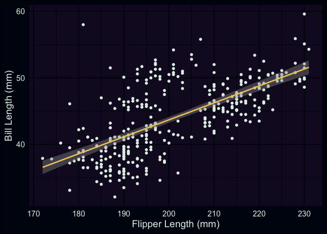
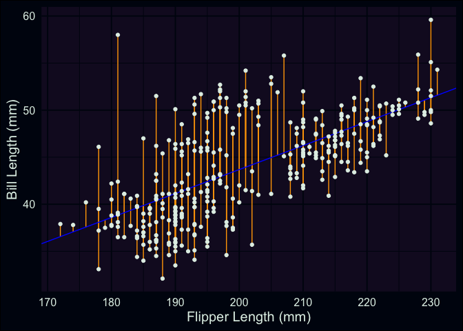
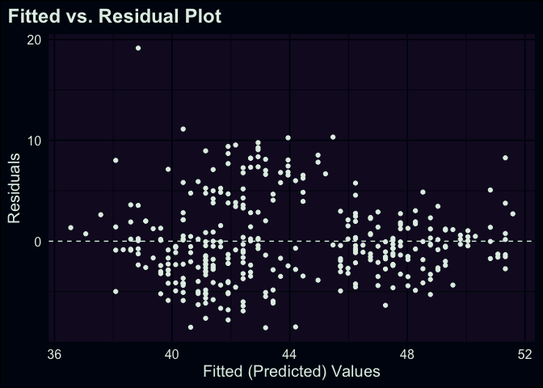
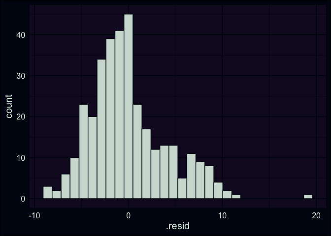

<script>
  import Banner from "$lib/util/Banner.svelte";
  import Head from "$lib/components/Head.svelte";
</script>
<style>
  img {
    object-fit: scale-down;
    max-width: 100%;
  }
</style>
<Head title="A primer for Linear Regression (part 2)" />

<Banner sub="A primer for Linear Regression" link="/projects/linear-regression-primer" />

{date}

# Part 2

In the [previous post](/projects/linear-regression-primer/1) of this
series, we covered an overview of the *Ordinary Least Squares* method
for estimating the *parameters* of a linear regression model. While I
didn’t give you a full tour of the mathematical guts underpinning the
technique, I’ve hopefully given you a sense of the problem the model is
attempting to solve, as well as some specific vocabulary that describes
the contents of a linear regression. In this post, we’re going to
continue working with the `{palmerpenguins}` data, but we’ll actually
cover the task of fitting a model in R, and inspecting the results. Some
of what we’ll cover is basic R, but we’ll also use a handful of
functions from `{broom}`, which is a really handy package for wrangling
information out of the objects that R creates to store linear models.

## building a model with lm()

We’ll start by loading the `{tidyverse}` and `{palmerpenguins}`
packages, given that we’ll be using contents from both within this post.
Then, we’ll return to our scatterplot, but this time I’m going to have R
plot the regression line between the two variables we’re interested in.
Using ggplot, it’s straightforward to add this line using
`geom_smooth()`. Inside this geom function, I’ve set the `method`
argument to “lm”, which tells R to fit a line to the data identified
within `aes()` using the `lm()` function.

``` r
library(tidyverse)
library(palmerpenguins)

ggplot(data = penguins, aes(x = flipper_length_mm, y = bill_length_mm)) +
  geom_point() +
  geom_smooth(method = "lm") +
  labs(x = "Flipper Length (mm)", y = "Bill Length (mm)")
```



As a small recap from last time, what we’ve just plotted is the line
that minimizes the total (summed) squared errors between each point and
the line. Now that we’ve visualized our data and the model we’re using
to summarize it, let’s try using the `lm()` function itself.

``` r
fit <- lm(formula = bill_length_mm ~ flipper_length_mm, data = penguins)
```

These commands aren’t super lengthy, but let’s look carefully at each
component. Inside `lm()`, I’ve specified two arguments: *formula*, and
*data*. The latter is hopefully self-explanatory; the `lm()` function
needs to know where to find the data that we want to analyze. In this
case, I’ve passed it the same data.frame we’ve been using up to now. On
the other hand, the *formula* argument is where we define the
relationships we want to model. In R, we do this by writing out an
equation, using the language’s “formula” notation. It might be helpful
to think of the `~` in an R formula as sort-of like an equals sign. In
the command above, we set our outcome as `bill_length_mm`, which is to
the left of the tilde. On the right-hand side, we have our predictor,
`flipper_length_mm`. R then uses what’s specified in the formula to fit
the model, looking in the data for the variable names referenced in the
equation. That’s it! We’ve built our first model– now it’s time to take
a look at the results.

In R, you can often get information from an object just by printing it.
For results produced by `lm()`, the output is fairly minimal– just the
formula and data used, along with the parameter estimates.

``` r
# just printing the object
fit
```

``` qmdresults

Call:
lm(formula = bill_length_mm ~ flipper_length_mm, data = penguins)

Coefficients:
      (Intercept)  flipper_length_mm  
          -7.2649             0.2548  
```

It’s more common to use the `summary()` function, which produces much
more detailed information about the contents/results of our model. We’ll
discuss each component in the next few sections.

``` r
# more detailed
summary(fit)
```

``` qmdresults

Call:
lm(formula = bill_length_mm ~ flipper_length_mm, data = penguins)

Residuals:
    Min      1Q  Median      3Q     Max 
-8.5792 -2.6715 -0.5721  2.0148 19.1518 

Coefficients:
                  Estimate Std. Error t value Pr(>|t|)    
(Intercept)       -7.26487    3.20016   -2.27   0.0238 *  
flipper_length_mm  0.25477    0.01589   16.03   <2e-16 ***
---
Signif. codes:  0 '***' 0.001 '**' 0.01 '*' 0.05 '.' 0.1 ' ' 1

Residual standard error: 4.126 on 340 degrees of freedom
  (2 observations deleted due to missingness)
Multiple R-squared:  0.4306,    Adjusted R-squared:  0.4289 
F-statistic: 257.1 on 1 and 340 DF,  p-value: < 2.2e-16
```

### residuals

At the top of what comes out of `summary()` when used on an `lm` object
is a description of the range and distribution of the model’s
*residuals*. Residuals are a really important concept in regression–
they’re one of the primary ways we’re able to investigate how well our
model fits the data we’re analyzing. In the last post, we actually
learned a bit about them, but I didn’t identify them by name.

To more clearly define them, a *residual* is the difference between each
of our penguin’s observed bill-length, and the predicted (fitted)
bill-length that’s generated by the model. To revisit a plot I used in
the last post, with updated values for $\beta_0$ and $\beta_1$, our
model’s predicted value for each point is the rising blue line (our
regression line). The residuals for each point are the vertical orange
segments that measure the distance between each point and the regression
line.

``` r
ggplot(penguins, aes(x = flipper_length_mm, y = bill_length_mm)) +
  geom_segment(aes(y = (-7.26487 + 0.25477 * flipper_length_mm), yend = bill_length_mm, x = flipper_length_mm, xend = flipper_length_mm), color = "orange") +
  geom_abline(intercept = -7.26487, slope = 0.25477, color = "blue") +
  geom_point() +
  labs(x = "Flipper Length (mm)", y = "Bill Length (mm)")
```



One of the primary ways we can use residuals to check how well our model
peforms is by creating *diagnostic plots*. Here I’m going to use the
`augment()` function from the `{broom}` package. You pass `augment()` a
model object (often those created by `lm` or `glm`), and it generates a
new data frame with the predicted/fitted values from the model, as well
as residuals.[^1] You can either calculate these things on your own, or
pull fitted values & residuals out of model objects using `fitted()` and
`resid()`, but using the broom function simplifies things a bit, given
that data frames are the standard currency for ggplots.

``` r
library(broom)

# create a data frame with variables used in model + residuals & fitted/predicted values, among other info
aug_fit <- augment(fit)

# don't miss the periods in front of .fitted and .resid!
ggplot(aug_fit, aes(x = .fitted, y = .resid)) +
  geom_hline(yintercept = 0, lty = "dashed") +
  geom_point() +
  labs(
    x = "Fitted (Predicted) Values", y = "Residuals",
    title = "Fitted vs. Residual Plot"
  )
```



The above plot is a more traditional way of looking at residuals
vs. predicted values. We’ve basically taken our regression line and laid
it flat horizontally. In this approach, you can scan across the range of
predicted values, checking how each point differs from 0. This style of
plot is helpful to examine if one of the classical assumptions for
linear regression is met: *whether the residuals have a stable variance
across the range of predicted values*. Just by eye-balling our plot, it
feels sketchy to assert that the spread of points is the same across the
whole range– in particular, it seems like there’s a difference in points
that have predicted values between 40 and 44 vs. elsewhere.

What about the sizes of the differences? If our data was strongly
linear, all the points would be really close to 0, but is this about
what we would expect if our model was fitting the data well? Are the
residuals roughly equally distributed above and below the regression
line? This leads us towards another common diagnostic plot, a simple
histogram of the residuals. Here we have a frequency distribution for
all of our data points, and we can visually check *if the residuals have
a normal distribution* (or approximately normal, being mound shaped &
roughly symmetric). If the residuals don’t exhibit this characteristic,
it can be another sign that the relationship being modeled isn’t
well-represented by a line. In our case, it’s not a perfectly
bell-shaped curve, but it’s passable.

``` r
ggplot(aug_fit, aes(x = .resid)) +
  geom_histogram()
```



### coefficients

Now we’ll move on to the next chunk of output, the model coefficients,
in this case $\hat{\beta_0}$ and $\hat{\beta_1}$. Here I’m going to use
the `tidy()` function from `{broom}` to represent this information
cleanly as a data frame (tibble). Each variable in the model is placed
under the `term` column, and the coefficient estimates are reported
under `estimate`. In the last post we spent a lot of time talking about
how the betas are estimated, and now that we have them, we can talk
about the other information that accompanies them.

``` r
tidy(fit)
```

``` qmdresults
# A tibble: 2 × 5
  term              estimate std.error statistic  p.value
  <chr>                <dbl>     <dbl>     <dbl>    <dbl>
1 (Intercept)         -7.26     3.20       -2.27 2.38e- 2
2 flipper_length_mm    0.255    0.0159     16.0  1.74e-43
```

The 3rd column, `std.error` is the *standard error of the coefficients*
(sometimes abbreviated “SE”). These represent the level of uncertainty
we have for each estimate. Gelman and Hill (2006) suggests that roughly
speaking, “estimates within 2 standard errors of $\hat{\beta}$ are
consistent with the data” (p.40).[^2] Applying this heuristic to our
table, this means that our intercept could be within \[-13.7, -0.9\] and
the coefficient for flipper length could range from \[-0.1, 0.6\].
Gelman and Hill (2006) also provide a rule of thumb that coefficients
\>2 SE from 0 can be considered “statistically significant” (although,
it’s worth emphasizing as they do, that this is not the same as being
“practically significant”). Aside from special cases in which two (or
more) predictors that are highly correlated with each other are each
included in the same model, standard errors should decrease as a
function of sample size.[^3] Thus, assuming your data is representative
of the population you’re studying, the parameters/coefficients of the
model will become more precise as more data is accumulated.

The last two columns, `statistic` and `p.value` are tricky to talk
about, and I hope to convince you that they’re less interesting than the
$\beta$s and SEs. Although practices are changing, there are sometimes
impressions that p-values for model coefficients can be seen as markers
of statistical (if not scientific) importance. The story of how this
impression gained prominence is complex, and in a future post I might
explore a narrow set of reasons for why it’s misguided. For our purposes
I hope I can briefly outline what information they *do* provide. In a
single sentence, they’re simply summarizing a ratio of the $\beta$s and
SEs. This ratio is called a *t-statistic*, and when using linear
regression, is computed for each coefficient using the following
formula:

$$
t_i = \frac{\hat{\beta_i}}{SE(\hat{\beta_i)}}
$$

In our case, the t-statistic for flipper length would be 0.255 / 0.0159
= 16.03 – which lines up with what’s reported in our output above.
Statistical theory tells us that this value should come from a
*t-distribution*, which can tell us the probability of getting a value
as large as, say 16.03, assuming that the expected value was 0. What we
can conclude practically here, is that the likelihood of seeing a value
of this size under our degrees-of-freedom is really small, and we have
some evidence against the assertion that the coefficient is equal to 0.
But that’s all we’re learning here; we’re just being told that the slope
*probably* isn’t flat. It’s also worth noting that this is where
sample-size becomes relevant for what a significant t-statistic can tell
you. As I noted above, SE should decrease as more data is collected.
This means that as SE approaches zero, even very small $\beta$s have a
chance to generate a t-statistic that’s associated with a very small
p-value.

### overall indices of fit

Okay! We made it to the last section on regression output! In this post,
we started very zoomed in, looking at differences between predicted
vs. actual points, and now we’re finishing with some big-picture aspects
of the model overall. We’re going to use another `{broom}` function,
called `glance()` to pull out this information. Like the `tidy()`
function, `glance()` also produces a data frame for us to work with.

``` r
glance(fit)
```

``` qmdresults
# A tibble: 1 × 12
  r.squared adj.r.squared sigma statistic  p.value    df logLik   AIC   BIC
      <dbl>         <dbl> <dbl>     <dbl>    <dbl> <dbl>  <dbl> <dbl> <dbl>
1     0.431         0.429  4.13      257. 1.74e-43     1  -969. 1944. 1955.
# ℹ 3 more variables: deviance <dbl>, df.residual <int>, nobs <int>
```

The first columns returned are `r.squared` and `adj.r.squared`; next to
p-values, an $R^2$ (“R-squared”) value is probably one of the most
recognizable terms for anyone learning about linear regression. Also
referred to as the coefficient of determination, the $R^2$ measures the
proportion of the outcome’s variance explained by the model, and ranges
from 0 to 1. More specifically, it is defined as
$R^2 = 1 - \hat{\sigma}^2 / s^2_y$, where $\hat{\sigma}^2$ (“sigma
squared”) is the unexplained variance of the model, and $s^2_y$ is the
variance of the outcome. However, it’s more common in practice to prefer
the *adjusted R-squared*, which accounts for the number of predictors
that are included in the model. This is because $R^2$s generally go up
as an analyst adds more & more variables to a model, and thus it’s
sensible to adjust for this fact.

This leads us into discussing the next column, `sigma`, also known as
*residual standard deviation*[^4] and often symbolized by
$\hat{\sigma}$. Again referring to Gelman and Hill (2006) (emphasis
mine), “we can think of this standard deviation as a measure of the
*average distance* each observation falls from its prediction from the
model” (p.41). This is a useful way of succinctly summarizing the
accuracy of the model’s predictions. In our case, our predictions are
off by an average of 4.1mm. Perhaps there’s room for improvement!

The next two columns, `statistic` and `p.value`, report the results of
the model’s F-test, or omnibus test. I don’t want to spend much time on
these two, so in brief, the results of this test summarize a comparison
between a *null model* (i.e. a model with just an intercept, and no
predictors) versus the fitted model you specified. A large F-statistic
and small p-value will occur when at least *one* of your predictors is
better at explaining the outcome than the null model. Phrased
differently, this result indicates whether your proposed model is better
at predicting the outcome better than just the outcome’s mean. The
reason I don’t find this test very useful is that if you look at the
estimated coefficients and see any predictor that’s likely different
from 0 (i.e. the $\hat{\beta}$ isn’t super close to 0, and its standard
error is small), you already have the same information the F-test would
provide.

Okay, last few columns from `glance()`:

- `df.residual` and `df`
  - In regression analysis, the *degrees of freedom* is calculated as
    $n - k$, where $n$ is the number of observations, and $k$ is the
    number of estimated coefficients (including the intercept). In the
    output from `glance()`, this information is reported in the
    `df.residual` column. The other column, `df` reports $k$, but omits
    the intercept (it can be read as the number of *predictors* in your
    model).
- `logLik`, `AIC`, `BIC`
  - I’m not going to go in-depth on the output of these columns in this
    post. Each of these quantities are hard to interpret because their
    scales aren’t really meaningful in isolation. The `deviance` column
    also falls into this category. They become more valuable in the
    context of *model comparison*, i.e. when you have multiple sets of
    predictors, and have specific hypotheses about whether model “A” is
    better for explaining the outcome compared to model “B”.
- `nobs`
  - This is just the \# of observations that were included in your final
    model. That’s all! Note that R will exclude observations from the
    results if they have missing data for any of the variables (outcome
    or predictor) included in the model formula.

## okay, (mostly?) done with new terminology

Up to now, we’ve covered the following:

1.  How to plot a regression line using ggplot and `geom_smooth()`, and
    how to fit a basic model using `lm()`
2.  Discussed residuals conceptually, and introduced a few common
    diagnostic plots
    - In relation to this topic, we discussed two assumptions underlying
      linear regression: a) stable variance in the residuals across the
      range of fitted values, and b) the distribution of residuals
      should be normal (or at least, approximately normal).
3.  Covered how to extract output from a regression model in R, using
    `tidy()` and `glance()`.
    - Here we also talked about the standard error of model
      coefficients, as well as the overall residual standard deviation,
      which are important for understanding the uncertainty about the
      different estimates produced during the analysis.

At this point, I think we’re mostly done with introducing significant
concepts and terminology. We’ve worked through most of the components
and pieces that comprise a linear regression analysis and the standard
kinds of output that R provides. In what I believe will be the [final
post](/projects/linear-regression-primer/3), we’ll turn to the topic of
multiple linear regression (i.e., linear regressions that feature more
than 1 predictor), and focus a bit more closely on how to interpret the
estimated coefficients.

## references

<div id="refs" class="references csl-bib-body hanging-indent">

<div id="ref-gelman2006data" class="csl-entry">

Gelman, Andrew, and Jennifer Hill. 2006. *Data Analysis Using Regression
and Multilevel/Hierarchical Models*. Cambridge university press.

</div>

</div>

[^1]: You can also give `augment()` a new dataset with observations you
    want predictions for. As long as all the variables used by the model
    are in your new dataset, you just need to use the equivalent of
    `augment(fit, newdata = my_new_data)`.

[^2]: As Gelman and Hill note, this is a bit of a short-cut but they
    indicate its generally fine to use if the degrees-of-freedom in the
    model are \>30. In the context of linear regression, degrees of
    freedom can be found by calculating $n - k$, where $n$ is the number
    of observations in your data, and $k$ is the number of parameters
    being estimated.

[^3]: Honestly, might need a citation here– my recollection is that this
    can be one of the problems caused by *collinearity*, and that when
    variables that correlate strongly ($r \geq 0.5?$) are included in
    the same model, both the coefficient estimates can be affected, as
    well as the standard errors for the affected variables.

[^4]: Ideally this won’t be distracting, but I want to note that what R
    labels as “residual standard error” in the output of `summary()` is
    actually **residual standard deviation.** I found this initially
    confusing in terms of trying to understand what I was learning about
    in textbooks etc. versus what I was being given in my output by R.
    The help documentation for `?sigma` explains that this is a quirk of
    an old misnaming that pre-dates R and existed in its predecessor
    (the S language). Hopefully this saves you a headache in the
    long-term!
