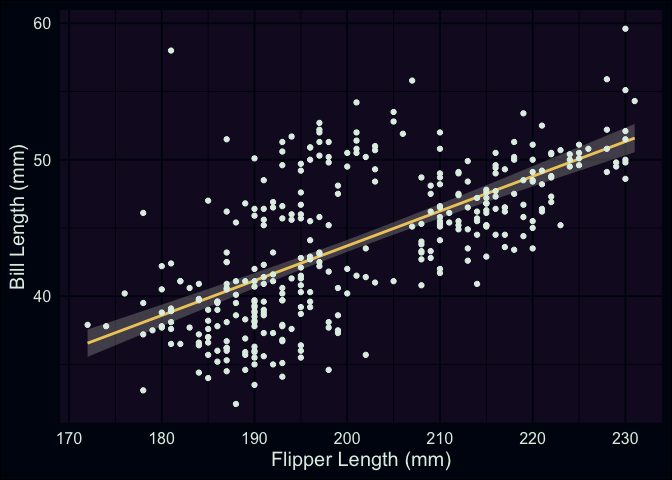
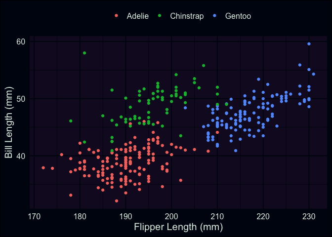
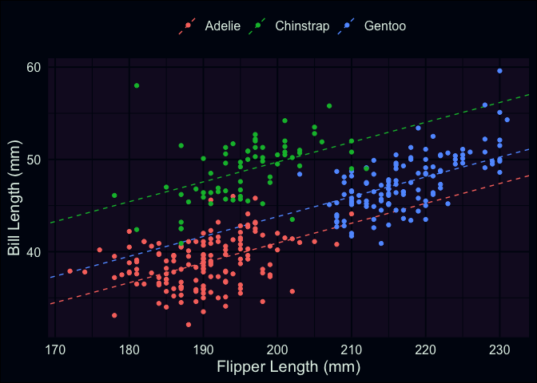

<script>
  import Banner from "$lib/home/Banner.svelte";
  import Head from "$lib/components/Head.svelte";
</script>
<style>
  img {
    object-fit: scale-down;
    max-width: 100%;
  }
</style>
<Head title="A primer for Linear Regression (part 3)" />

<Banner sub="A primer for Linear Regression" link="/projects/linear-regression-primer" />

{date}

# Part 3

Now our focus will shift to multiple regression (i.e. linear regression
with \>1 predictors), as opposed to *simple* linear regression (linear
regression with just 1 predictor). Simple linear regressions have the
benefit of being easy to visualize, and this makes it much easier to
explain different concepts. However, real-world questions are often
complex, and it’s frequently necessary to account for more than one
relevant variable in an analysis. As with the
[last](/projects/linear-regression-primer/1)
[two](/projects/linear-regression-primer/2) posts, we’ll stick with the
Palmer Penguins data, and now that they’ve been introduced, I’ll be
using functions from the `{broom}` package (such as `tidy()`, `glance()`
and `augment()`) a bit more freely.

## updating our basic model

Let’s start by looking at the basic model we’ve been working with up to
now.

``` r
library(tidyverse)
library(palmerpenguins)
library(broom)

fit <- lm(bill_length_mm ~ flipper_length_mm, data = penguins)

# check the coefficients
tidy(fit)
```

``` qmdresults
# A tibble: 2 × 5
  term              estimate std.error statistic  p.value
  <chr>                <dbl>     <dbl>     <dbl>    <dbl>
1 (Intercept)         -7.26     3.20       -2.27 2.38e- 2
2 flipper_length_mm    0.255    0.0159     16.0  1.74e-43
```

``` r
# extract the residual standard deviation
sigma(fit)
```

``` qmdresults
[1] 4.125874
```

``` r
ggplot(penguins, aes(x = flipper_length_mm, y = bill_length_mm)) +
  geom_smooth(method = "lm") +
  geom_point() +
  labs(x = "Flipper Length (mm)", y = "Bill Length (mm)")
```



The plot shows pretty clearly that there’s a positive association
between our two variables. However, you can clearly see that our line is
missing a little cloud of points in the upper middle of the plot.
Additionally, the spread of penguins with bill lengths less than 40mm
and flippers between 180 - 200mm also don’t seem to be well explained by
our line. Characteristics like this contributes to a higher *residual
standard deviation*, which in this case is about 4.1mm.

This was something I had alluded to in part 1, but the explanation is
straightforward: our data actually contains measurements from 3
different species! While there are some outliers (such as the
particularly long-nosed fellow up in the top-right, and the adventurous
Adelie that’s hanging out with the Gentoo), the groups are pretty
distinct, and don’t overlap too much. It also looks like the
relationship between our original two variables is still apparent
*within* each of our groups.

``` r
ggplot(penguins, aes(x = flipper_length_mm, y = bill_length_mm, color = species)) +
  geom_point() +
  theme(legend.position = "top") +
  labs(x = "Flipper Length (mm)", y = "Bill Length (mm)", color = "")
```



Now that we’re aware of this relationship, a logical approach would be
to introduce an adjustment that accounts for the patterns we’re seeing.
For example, the average bill-length of the Chinstrap penguins seems to
be about 50mm, compared to the overall mean, which is maybe between 44
and 45mm. Multiple regression allows us to represent this in our model
in a straightforward way. We’ll create a new model, adding our new
predictor to the formula using a `+` sign. Then, we’ll take a look at
the estimated coefficients.

``` r
fit2 <- lm(bill_length_mm ~ flipper_length_mm + species, data = penguins)

tidy(fit2)
```

``` qmdresults
# A tibble: 4 × 5
  term              estimate std.error statistic  p.value
  <chr>                <dbl>     <dbl>     <dbl>    <dbl>
1 (Intercept)         -2.06     4.04      -0.510 6.11e- 1
2 flipper_length_mm    0.215    0.0212    10.1   3.12e-21
3 speciesChinstrap     8.78     0.399     22.0   3.39e-67
4 speciesGentoo        2.86     0.659      4.34  1.90e- 5
```

Okay, now we have a few new coefficients in our model, specifically new
rows for our Chinstrap and Gentoo groups. Your first question might be:
“What about the Adelie? Are they missing?” No, they’re still in our
model, but you might say they’re being held as a contrast against the
other two species. Under the hood, R is creating *indicator variables*
(columns that give each observation a 0 or 1 based on some criteria)
that are then used as predictors in our model. When working with
non-numeric data (like the name or group membership of a species of
animal), we have to represent that information in a way that our
formulas & computers can use. When we put a categorical variable into a
formula, like we did here,

`bill_length_mm ~ flipper_length_mm + species`

R generates the necessary indicator columns automatically, and includes
them as predictors.

Thus, we end up with something like this:

`bill_length_mm ~ flipper_length_mm + speciesChinstrap + speciesGentoo`

Here’s what these indicator variables look like for 3 penguins (one from
each species). Given that we have 3 groups/species, we can identify
membership using just 2 columns. Each unique combination of rows
corresponds to a different group.

``` r
contrasts(penguins$species)
```

``` qmdresults
          Chinstrap Gentoo
Adelie            0      0
Chinstrap         1      0
Gentoo            0      1
```

So, to answer “where” the Adelie are, their rows are identified when the
`speciesChinstrap` and `speciesGentoo` columns are both equal to 0.

## interpreting the estimated coefficients

Until now, I’ve held off on discussing in-depth on how to interpret the
results from a regression. In the case of simple linear regression,
we’ve been able to talk about $\hat{\beta_1}$ as the slope for the
best-fitting line between two variables. This interpretation remains
valid for multiple regression, but obviously gets more complex as the
number of variables increases. You can represent two variables on an
*X-Y plane*, but when you have 3, 4, 10 different variables & their
respective associations? The betas then describe slopes on a
multidimensional *surface* that’s hard (if not impossible) for us to
visualize in a sensical way. In our case, it can still be tractable, but
first we’re going to focus on the model’s representation as an equation.

Here’s our simple model:

$\widehat{\text{bill length}} = -7.26 + 0.255(\text{flipper length})$

And our updated model:

$\widehat{\text{bill length}} = -2.06 + 0.215(\text{flipper length}) + 8.78(\text{speciesChinstrap}) + 2.86(\text{speciesGentoo})$

Now, let’s imagine feeding these models some new data. Let’s start by
thinking about what the intercept is doing in both equations. Is it
something that’s directly meaningful? No. If we somehow had a bird with
flippers of length 0, our models would predict a bill length of -7.26
and -2.06, respectively. In any regression model, the intercept value
will be the model’s prediction if *all* the predictors in the model were
set to 0.[^1] For the non-intercept terms, if you’re interested in
variable $x_k$, you can read its coefficient $\hat\beta_k$ as the
*expected change in $\hat{y}$ when increasing (or decreasing) the value
of $x_k$ by 1.* Note this is the expected change holding all the other
variables in the model constant. That is, if I set all the other
variables to something pre-specified (such as 0), and only change my
input for $x_k$ by 1-unit, I’ll see $\hat{y}$ move in a single increment
of $\hat\beta_k$.

The idea of holding other variables “constant” might become clearer as
we generate predictions for some example penguins. As a practical
example, let’s see what our models would predict for an Adelie penguin
with a flipper length of 190mm. Plugging in this information gives us:

$41.19 = -7.26 + (0.255*190)$

$38.79 = -2.06 + (0.215*190) + (8.78*0) + (2.86*0)$

In our first model, we aren’t accounting for the species of the penguin,
so we just multiply the flipper length by our coefficient, and sum
everything. In our updated model, we account for species. Remember, in
our data, Adelie penguins are identified as have a value of *0* for both
`speciesChinstrap` and `speciesGentoo`. Because of this, the two terms
on the end simply become 0s when everything gets combined. If we looked
at a Gentoo penguin with the same flipper length, we’d get the following
instead:

$41.65 = -2.06 + (0.215*190) + (8.78*0) + (2.86*1)$

Now the adjustment for being a member of the Gentoo species is added, as
the `speciesGentoo` indicator variable goes from 0 to 1. We get an
additional bump of 2.86mm in bill length, compared to our prediction for
an Adelie. Doing this by hand is fine for one or two examples, but you
can get R to generate this information for you, using `predict()`. We’ll
put our example birds into a data frame, and compare my calculations to
what R produces.

``` r
example_penguins <- tibble(species = c("Adelie", "Gentoo"), flipper_length_mm = 190)

# using our initial (simple) model
predict(object = fit, newdata = example_penguins)
```

``` qmdresults
       1        2 
41.14108 41.14108 
```

``` r
# using our updated model, which adjusts for species
predict(object = fit2, newdata = example_penguins)
```

``` qmdresults
       1        2 
38.80136 41.65825 
```

Pretty close, although the results from `predict()` are slightly
different, given that I only used up to two digits of each
coefficient/intercept when doing things by hand.

## how do the models compare?

Okay, we’ve now built an updated model, and discussed how to interpret
estimated coefficients. We’ll finish things up by doing our best attempt
to visualize the new model, and making a few diagnostic plots to see
if/how things have improved.

Let’s start by adding our regression line (with adjustments) to the
scatterplot.

``` r
# create a data-frame with estimated slope, intercept, & adjustments for each species
species_lines <- tibble(
  species = c("Adelie", "Chinstrap", "Gentoo"),
  intercept = c(-2.06, -2.06 + 8.78, -2.06 + 2.86),
  slope = .215
)

ggplot(penguins, aes(x = flipper_length_mm, y = bill_length_mm, color = species)) +
  geom_abline(
    data = species_lines,
    aes(intercept = intercept, slope = slope, color = species),
    lty = "dashed"
  ) +
  geom_point() +
  theme(legend.position = "top") +
  labs(x = "Flipper Length (mm)", y = "Bill Length (mm)", color = "")
```



As you can see, we have the same slope regardless of which species we’re
looking at, but I’ve ensured that each colored line has its y-intercept
adjusted based on the estimated coefficients for each species.
Visually-speaking, we can see that the model’s predictions can be
improved a lot by knowing which species you’re interested in. Let’s take
a look at the residuals themselves.

``` r
aug_fit2 <- augment(fit2)

ggplot(aug_fit2, aes(x = .fitted, y = .resid, color = species)) +
  geom_hline(yintercept = 0, lty = "dashed") +
  geom_point() +
  theme(legend.position = "top") +
  labs(x = "Fitted (Predicted) Values", y = "Residual", color = "")
```


Here we can see that our fitted values have basically broken into two
groups. However, this is a good thing! If you look at the previous
scatter plots, you can see that the Adelie tend to have shorter bills on
average, whereas the Chinstrap and Gentoo are more similar in this
respect. It also seems like most of our predictions were within $\pm5$mm
of the true values for bill length. We can get the specific estimate for
residual standard deviation ($\hat\sigma$) and other information from
`glance()`.

``` r
bind_rows(Simple = glance(fit), Updated = glance(fit2), .id = "model") %>%
  mutate(across(where(is.numeric), round, 2)) %>%
  gt::gt(rowname_col = "model")
```

<div id="bxbobriywa" style="padding-left:0px;padding-right:0px;padding-top:10px;padding-bottom:10px;overflow-x:auto;overflow-y:auto;width:auto;height:auto;">
<style>#bxbobriywa table {
  font-family: system-ui, 'Segoe UI', Roboto, Helvetica, Arial, sans-serif, 'Apple Color Emoji', 'Segoe UI Emoji', 'Segoe UI Symbol', 'Noto Color Emoji';
  -webkit-font-smoothing: antialiased;
  -moz-osx-font-smoothing: grayscale;
}

#bxbobriywa thead, #bxbobriywa tbody, #bxbobriywa tfoot, #bxbobriywa tr, #bxbobriywa td, #bxbobriywa th {
  border-style: none;
}

#bxbobriywa p {
  margin: 0;
  padding: 0;
}

#bxbobriywa .gt_table {
  display: table;
  border-collapse: collapse;
  line-height: normal;
  margin-left: auto;
  margin-right: auto;
  color: #333333;
  font-size: 16px;
  font-weight: normal;
  font-style: normal;
  background-color: #FFFFFF;
  width: auto;
  border-top-style: solid;
  border-top-width: 2px;
  border-top-color: #A8A8A8;
  border-right-style: none;
  border-right-width: 2px;
  border-right-color: #D3D3D3;
  border-bottom-style: solid;
  border-bottom-width: 2px;
  border-bottom-color: #A8A8A8;
  border-left-style: none;
  border-left-width: 2px;
  border-left-color: #D3D3D3;
}

#bxbobriywa .gt_caption {
  padding-top: 4px;
  padding-bottom: 4px;
}

#bxbobriywa .gt_title {
  color: #333333;
  font-size: 125%;
  font-weight: initial;
  padding-top: 4px;
  padding-bottom: 4px;
  padding-left: 5px;
  padding-right: 5px;
  border-bottom-color: #FFFFFF;
  border-bottom-width: 0;
}

#bxbobriywa .gt_subtitle {
  color: #333333;
  font-size: 85%;
  font-weight: initial;
  padding-top: 3px;
  padding-bottom: 5px;
  padding-left: 5px;
  padding-right: 5px;
  border-top-color: #FFFFFF;
  border-top-width: 0;
}

#bxbobriywa .gt_heading {
  background-color: #FFFFFF;
  text-align: center;
  border-bottom-color: #FFFFFF;
  border-left-style: none;
  border-left-width: 1px;
  border-left-color: #D3D3D3;
  border-right-style: none;
  border-right-width: 1px;
  border-right-color: #D3D3D3;
}

#bxbobriywa .gt_bottom_border {
  border-bottom-style: solid;
  border-bottom-width: 2px;
  border-bottom-color: #D3D3D3;
}

#bxbobriywa .gt_col_headings {
  border-top-style: solid;
  border-top-width: 2px;
  border-top-color: #D3D3D3;
  border-bottom-style: solid;
  border-bottom-width: 2px;
  border-bottom-color: #D3D3D3;
  border-left-style: none;
  border-left-width: 1px;
  border-left-color: #D3D3D3;
  border-right-style: none;
  border-right-width: 1px;
  border-right-color: #D3D3D3;
}

#bxbobriywa .gt_col_heading {
  color: #333333;
  background-color: #FFFFFF;
  font-size: 100%;
  font-weight: normal;
  text-transform: inherit;
  border-left-style: none;
  border-left-width: 1px;
  border-left-color: #D3D3D3;
  border-right-style: none;
  border-right-width: 1px;
  border-right-color: #D3D3D3;
  vertical-align: bottom;
  padding-top: 5px;
  padding-bottom: 6px;
  padding-left: 5px;
  padding-right: 5px;
  overflow-x: hidden;
}

#bxbobriywa .gt_column_spanner_outer {
  color: #333333;
  background-color: #FFFFFF;
  font-size: 100%;
  font-weight: normal;
  text-transform: inherit;
  padding-top: 0;
  padding-bottom: 0;
  padding-left: 4px;
  padding-right: 4px;
}

#bxbobriywa .gt_column_spanner_outer:first-child {
  padding-left: 0;
}

#bxbobriywa .gt_column_spanner_outer:last-child {
  padding-right: 0;
}

#bxbobriywa .gt_column_spanner {
  border-bottom-style: solid;
  border-bottom-width: 2px;
  border-bottom-color: #D3D3D3;
  vertical-align: bottom;
  padding-top: 5px;
  padding-bottom: 5px;
  overflow-x: hidden;
  display: inline-block;
  width: 100%;
}

#bxbobriywa .gt_spanner_row {
  border-bottom-style: hidden;
}

#bxbobriywa .gt_group_heading {
  padding-top: 8px;
  padding-bottom: 8px;
  padding-left: 5px;
  padding-right: 5px;
  color: #333333;
  background-color: #FFFFFF;
  font-size: 100%;
  font-weight: initial;
  text-transform: inherit;
  border-top-style: solid;
  border-top-width: 2px;
  border-top-color: #D3D3D3;
  border-bottom-style: solid;
  border-bottom-width: 2px;
  border-bottom-color: #D3D3D3;
  border-left-style: none;
  border-left-width: 1px;
  border-left-color: #D3D3D3;
  border-right-style: none;
  border-right-width: 1px;
  border-right-color: #D3D3D3;
  vertical-align: middle;
  text-align: left;
}

#bxbobriywa .gt_empty_group_heading {
  padding: 0.5px;
  color: #333333;
  background-color: #FFFFFF;
  font-size: 100%;
  font-weight: initial;
  border-top-style: solid;
  border-top-width: 2px;
  border-top-color: #D3D3D3;
  border-bottom-style: solid;
  border-bottom-width: 2px;
  border-bottom-color: #D3D3D3;
  vertical-align: middle;
}

#bxbobriywa .gt_from_md > :first-child {
  margin-top: 0;
}

#bxbobriywa .gt_from_md > :last-child {
  margin-bottom: 0;
}

#bxbobriywa .gt_row {
  padding-top: 8px;
  padding-bottom: 8px;
  padding-left: 5px;
  padding-right: 5px;
  margin: 10px;
  border-top-style: solid;
  border-top-width: 1px;
  border-top-color: #D3D3D3;
  border-left-style: none;
  border-left-width: 1px;
  border-left-color: #D3D3D3;
  border-right-style: none;
  border-right-width: 1px;
  border-right-color: #D3D3D3;
  vertical-align: middle;
  overflow-x: hidden;
}

#bxbobriywa .gt_stub {
  color: #333333;
  background-color: #FFFFFF;
  font-size: 100%;
  font-weight: initial;
  text-transform: inherit;
  border-right-style: solid;
  border-right-width: 2px;
  border-right-color: #D3D3D3;
  padding-left: 5px;
  padding-right: 5px;
}

#bxbobriywa .gt_stub_row_group {
  color: #333333;
  background-color: #FFFFFF;
  font-size: 100%;
  font-weight: initial;
  text-transform: inherit;
  border-right-style: solid;
  border-right-width: 2px;
  border-right-color: #D3D3D3;
  padding-left: 5px;
  padding-right: 5px;
  vertical-align: top;
}

#bxbobriywa .gt_row_group_first td {
  border-top-width: 2px;
}

#bxbobriywa .gt_row_group_first th {
  border-top-width: 2px;
}

#bxbobriywa .gt_summary_row {
  color: #333333;
  background-color: #FFFFFF;
  text-transform: inherit;
  padding-top: 8px;
  padding-bottom: 8px;
  padding-left: 5px;
  padding-right: 5px;
}

#bxbobriywa .gt_first_summary_row {
  border-top-style: solid;
  border-top-color: #D3D3D3;
}

#bxbobriywa .gt_first_summary_row.thick {
  border-top-width: 2px;
}

#bxbobriywa .gt_last_summary_row {
  padding-top: 8px;
  padding-bottom: 8px;
  padding-left: 5px;
  padding-right: 5px;
  border-bottom-style: solid;
  border-bottom-width: 2px;
  border-bottom-color: #D3D3D3;
}

#bxbobriywa .gt_grand_summary_row {
  color: #333333;
  background-color: #FFFFFF;
  text-transform: inherit;
  padding-top: 8px;
  padding-bottom: 8px;
  padding-left: 5px;
  padding-right: 5px;
}

#bxbobriywa .gt_first_grand_summary_row {
  padding-top: 8px;
  padding-bottom: 8px;
  padding-left: 5px;
  padding-right: 5px;
  border-top-style: double;
  border-top-width: 6px;
  border-top-color: #D3D3D3;
}

#bxbobriywa .gt_last_grand_summary_row_top {
  padding-top: 8px;
  padding-bottom: 8px;
  padding-left: 5px;
  padding-right: 5px;
  border-bottom-style: double;
  border-bottom-width: 6px;
  border-bottom-color: #D3D3D3;
}

#bxbobriywa .gt_striped {
  background-color: rgba(128, 128, 128, 0.05);
}

#bxbobriywa .gt_table_body {
  border-top-style: solid;
  border-top-width: 2px;
  border-top-color: #D3D3D3;
  border-bottom-style: solid;
  border-bottom-width: 2px;
  border-bottom-color: #D3D3D3;
}

#bxbobriywa .gt_footnotes {
  color: #333333;
  background-color: #FFFFFF;
  border-bottom-style: none;
  border-bottom-width: 2px;
  border-bottom-color: #D3D3D3;
  border-left-style: none;
  border-left-width: 2px;
  border-left-color: #D3D3D3;
  border-right-style: none;
  border-right-width: 2px;
  border-right-color: #D3D3D3;
}

#bxbobriywa .gt_footnote {
  margin: 0px;
  font-size: 90%;
  padding-top: 4px;
  padding-bottom: 4px;
  padding-left: 5px;
  padding-right: 5px;
}

#bxbobriywa .gt_sourcenotes {
  color: #333333;
  background-color: #FFFFFF;
  border-bottom-style: none;
  border-bottom-width: 2px;
  border-bottom-color: #D3D3D3;
  border-left-style: none;
  border-left-width: 2px;
  border-left-color: #D3D3D3;
  border-right-style: none;
  border-right-width: 2px;
  border-right-color: #D3D3D3;
}

#bxbobriywa .gt_sourcenote {
  font-size: 90%;
  padding-top: 4px;
  padding-bottom: 4px;
  padding-left: 5px;
  padding-right: 5px;
}

#bxbobriywa .gt_left {
  text-align: left;
}

#bxbobriywa .gt_center {
  text-align: center;
}

#bxbobriywa .gt_right {
  text-align: right;
  font-variant-numeric: tabular-nums;
}

#bxbobriywa .gt_font_normal {
  font-weight: normal;
}

#bxbobriywa .gt_font_bold {
  font-weight: bold;
}

#bxbobriywa .gt_font_italic {
  font-style: italic;
}

#bxbobriywa .gt_super {
  font-size: 65%;
}

#bxbobriywa .gt_footnote_marks {
  font-size: 75%;
  vertical-align: 0.4em;
  position: initial;
}

#bxbobriywa .gt_asterisk {
  font-size: 100%;
  vertical-align: 0;
}

#bxbobriywa .gt_indent_1 {
  text-indent: 5px;
}

#bxbobriywa .gt_indent_2 {
  text-indent: 10px;
}

#bxbobriywa .gt_indent_3 {
  text-indent: 15px;
}

#bxbobriywa .gt_indent_4 {
  text-indent: 20px;
}

#bxbobriywa .gt_indent_5 {
  text-indent: 25px;
}
</style>
<table class="gt_table" data-quarto-disable-processing="false" data-quarto-bootstrap="false">
  <thead>
    
    <tr class="gt_col_headings">
      <th class="gt_col_heading gt_columns_bottom_border gt_left" rowspan="1" colspan="1" scope="col" id=""></th>
      <th class="gt_col_heading gt_columns_bottom_border gt_right" rowspan="1" colspan="1" scope="col" id="r.squared">r.squared</th>
      <th class="gt_col_heading gt_columns_bottom_border gt_right" rowspan="1" colspan="1" scope="col" id="adj.r.squared">adj.r.squared</th>
      <th class="gt_col_heading gt_columns_bottom_border gt_right" rowspan="1" colspan="1" scope="col" id="sigma">sigma</th>
      <th class="gt_col_heading gt_columns_bottom_border gt_right" rowspan="1" colspan="1" scope="col" id="statistic">statistic</th>
      <th class="gt_col_heading gt_columns_bottom_border gt_right" rowspan="1" colspan="1" scope="col" id="p.value">p.value</th>
      <th class="gt_col_heading gt_columns_bottom_border gt_right" rowspan="1" colspan="1" scope="col" id="df">df</th>
      <th class="gt_col_heading gt_columns_bottom_border gt_right" rowspan="1" colspan="1" scope="col" id="logLik">logLik</th>
      <th class="gt_col_heading gt_columns_bottom_border gt_right" rowspan="1" colspan="1" scope="col" id="AIC">AIC</th>
      <th class="gt_col_heading gt_columns_bottom_border gt_right" rowspan="1" colspan="1" scope="col" id="BIC">BIC</th>
      <th class="gt_col_heading gt_columns_bottom_border gt_right" rowspan="1" colspan="1" scope="col" id="deviance">deviance</th>
      <th class="gt_col_heading gt_columns_bottom_border gt_right" rowspan="1" colspan="1" scope="col" id="df.residual">df.residual</th>
      <th class="gt_col_heading gt_columns_bottom_border gt_right" rowspan="1" colspan="1" scope="col" id="nobs">nobs</th>
    </tr>
  </thead>
  <tbody class="gt_table_body">
    <tr><th id="stub_1_1" scope="row" class="gt_row gt_left gt_stub">Simple</th>
<td headers="stub_1_1 r.squared" class="gt_row gt_right">0.43</td>
<td headers="stub_1_1 adj.r.squared" class="gt_row gt_right">0.43</td>
<td headers="stub_1_1 sigma" class="gt_row gt_right">4.13</td>
<td headers="stub_1_1 statistic" class="gt_row gt_right">257.09</td>
<td headers="stub_1_1 p.value" class="gt_row gt_right">0</td>
<td headers="stub_1_1 df" class="gt_row gt_right">1</td>
<td headers="stub_1_1 logLik" class="gt_row gt_right">-968.98</td>
<td headers="stub_1_1 AIC" class="gt_row gt_right">1943.97</td>
<td headers="stub_1_1 BIC" class="gt_row gt_right">1955.47</td>
<td headers="stub_1_1 deviance" class="gt_row gt_right">5787.76</td>
<td headers="stub_1_1 df.residual" class="gt_row gt_right">340</td>
<td headers="stub_1_1 nobs" class="gt_row gt_right">342</td></tr>
    <tr><th id="stub_1_2" scope="row" class="gt_row gt_left gt_stub">Updated</th>
<td headers="stub_1_2 r.squared" class="gt_row gt_right">0.78</td>
<td headers="stub_1_2 adj.r.squared" class="gt_row gt_right">0.77</td>
<td headers="stub_1_2 sigma" class="gt_row gt_right">2.60</td>
<td headers="stub_1_2 statistic" class="gt_row gt_right">389.97</td>
<td headers="stub_1_2 p.value" class="gt_row gt_right">0</td>
<td headers="stub_1_2 df" class="gt_row gt_right">3</td>
<td headers="stub_1_2 logLik" class="gt_row gt_right">-809.56</td>
<td headers="stub_1_2 AIC" class="gt_row gt_right">1629.12</td>
<td headers="stub_1_2 BIC" class="gt_row gt_right">1648.29</td>
<td headers="stub_1_2 deviance" class="gt_row gt_right">2278.34</td>
<td headers="stub_1_2 df.residual" class="gt_row gt_right">338</td>
<td headers="stub_1_2 nobs" class="gt_row gt_right">342</td></tr>
  </tbody>
  
  
</table>
</div>

<br>

Here I’ve taken the output for `glance()` from each model and stacked
them[^2]. By basically every criteria that’s reported in this output,
our updated model is preferable to the simple linear regression. Our
$R^2$ has increased by a lot, and the values for `logLik`, `AIC`, `BIC`,
and `deviance` are all smaller under the updated model, each suggesting
a better fit. Of practical note, our value for $\hat\sigma$ has
decreased by about 1.5mm. While there’s still a fair bit of variability
in the outcome, cutting down our average error is an improvement.

## wrap-up

Whew, we’re done (at least with with what I’d initially planned to
cover)! There are perhaps two practical items that I didn’t get to in
the main text. The first is the topic of *scaling* numeric variables,
which is often done after they’ve been *centered* (something I mentioned
in my first footnote). Scaling a variable by its standard deviation can
be helpful when you have many different predictors that are measured
differently, and want to ensure you have the same interpretation for
each of the coefficients. The second is the topic of including
*interactions* in a regression equation. In the context of regression,
an interaction between two (or more) variables exists when the
relationship between $y$ and $x_a$ depends on $x_b$ (or other $x$s).
This topic is complex, and a whole separate post could be dedicated to
defining, interpreting, and visualizing interactions. In the case of
this series, I wanted to focus on the fundamentals of linear regression
as an approach, of which interactions as a topic falls outside of scope.

If you’ve stuck with me through all 3 posts, thank you! I hope I’ve
built on any prior exposure you’ve had to the topics, and connected your
learning to practical tools in the R language. If you have any questions
on anything I’ve covered, or spotted any potential errors in something
I’ve discussed, please feel free to contact me!

[^1]: This means that in different contexts, the intercept can be
    substantively meaningful. However, this depends on whether it makes
    sense for your research question to have all the values of your
    variables equal to 0 at the same time. Taking our data for example,
    it’s nonsensical to think of a penguin with a flipper-length of 0.
    This is why it’s often common practice to *center* numeric variables
    (i.e., taking each observation from a variable and subtracting the
    variable’s mean). Once done, setting the transformed variable to 0
    is equivalent to setting it equal to its mean.

[^2]: I’m also printing things a bit more cleanly using the `gt()`
    function from the `{gt}` package.
